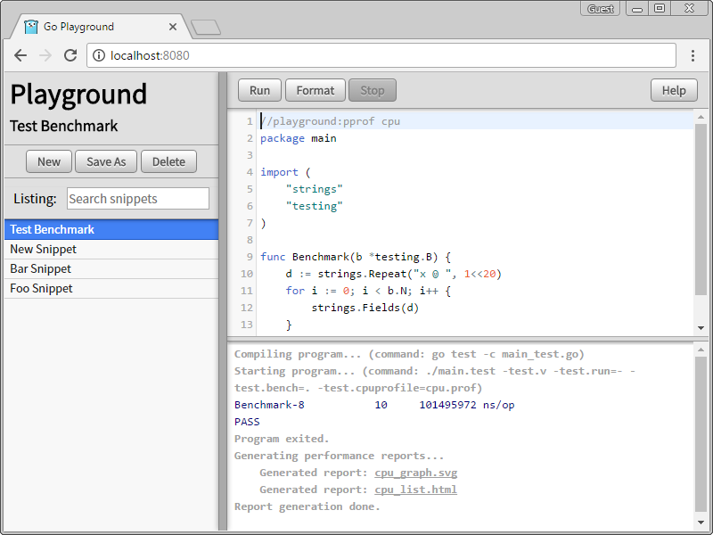

# Local Go Playground #

## Introduction ##

Playground is a web application that executes arbitrary Go code locally.
This tool provides the ability to save and load various code snippets,
the ability to run Go code using arbitrary third-party packages,
and the ability to run tests and benchmarks.



Since the Playground executes arbitrary Go code on the server it is running from,
there are obvious security implications. As a baseline, the Playground requires
a password in order use the service. However, anyone using this is responsible
for adding extra layers of security themselves:
* Consider running `playground` from a [Linux Container](https://linuxcontainers.org/)
or from a dedicated VM to sandbox the process.
* Consider using a web server (like [Caddy](https://caddyserver.com/)) to provide
automatic HTTPS and another layer of authentication.

Running the server is only supported on Linux and OSX.

## Basic Usage ##

Build the server:

```go get -u github.com/dsnet/playground```

Start the server (assuming `$GOPATH/bin` is in your `$PATH`):

```
$ playground
Enter a new Playground login password: ...
2017/05/11 18:07:07 main.go:184: loaded config:
{
	"ServeAddress": "localhost:8080",
	"PasswordSalt": "c9c8959441f5a49e0fed99a9a0704ef0725786b318304088fee0b9b1299a68f3",
	"PasswordHash": "ec3c17aba3fa603bc443e82b748db059bf294d9d3d9f975e15e9598241671af7",
	"DataPath": "/home/rawr/.playground",
	"GoBinary": "go",
	"FmtBinary": "goimports",
	"BinaryVersion": "Git+7ed13d2, Fri May 12 00:35:19 2017",
	"BinarySHA256": "c026207e6ff152e4f5b7be4a098577f164fed983650389a971a205384f5829aa"
}
2017/05/11 18:07:07 main.go:254: playground starting on localhost:8080
...
```

When running `playground` without a configuration file, it requires a password
to be supplied. The Playground can be interacted with by visiting
http://localhost:8080 in a browser.

The Playground executes arbitrary snippets of Go code. Each code snippet is an
individual Go program and will be executed as either an executable or
a test suite. The presence of a `main` function or any `Test` or `Benchmark`
functions determine what type of program it is.	These functions cannot be mixed;
that is, only one type or the other may exist within the snippet.
Lastly, all snippets must be within the `main` package.

## Advanced Usage ##

Typically, `playground` is started as a background service; in which case,
a configuration file should be provided. An example configuration file is:

```
{
	"ServeAddress": "localhost:8080",
	"LogFile": "daemon.log",
	"PasswordSalt": "ed1b3112286780279e740612b0a03f2c0d1550d5e7d2197c636b5d3eb6ee51b2",
	"PasswordHash": "4ef6b693629568e78ad0846ee189c8e9fdf719fbe631650ad547192d9c3490ba",
	"DataPath": "/usr/local/playground",
	"GoBinary": "go",
	"FmtBinary": "goimports",
	"Environment": {
		"PATH": "/usr/local/bin:/usr/bin:/bin",
		"GOPATH": "/path/to/gopath",
	},
}
```

The password fields consists of a randomly generated salt and a hashed version
of the actual password. This pair of values can be generated with the following
shell script:

```bash
#!/bin/bash
read -s -p "Password: " PASSWORD && echo
PASSWORD_SALT=$(head -c 1024 /dev/urandom | sha256sum | head -c 64)
PASSWORD_HASH=$(echo -n "$(echo $PASSWORD_SALT | xxd -r -p)${PASSWORD}" | sha256sum | head -c 64)
echo -en "PasswordSalt: $PASSWORD_SALT\nPasswordHash: $PASSWORD_HASH\n"
unset PASSWORD PASSWORD_SALT PASSWORD_HASH
```

See the `Help` in `main.go` for more details about configuration options.

See the `Help` in web interface for more details about using the Playground.
